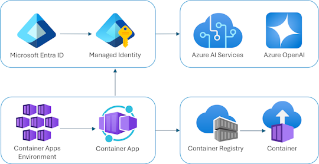

# Build your own ChatGPT app

This repository includes a simple Python [Quart](https://quart.palletsprojects.com/en/latest/)
app that streams responses from ChatGPT to an HTML/JS frontend using [JSON Lines](http://jsonlines.org/)
over a [ReadableStream](https://developer.mozilla.org/en-US/docs/Web/API/ReadableStream).

The repository is designed for use with [Docker containers](https://www.docker.com/), both for local development and deployment, and includes infrastructure files for deployment to [Azure Container Apps](https://learn.microsoft.com/azure/container-apps/overview). 🐳



We recommend first going through the [deployment steps](#deployment) before running this app locally,
since the local app needs credentials for Azure OpenAI to work properly.

## Opening the project

This project has [Dev Container support](https://code.visualstudio.com/docs/devcontainers/containers), so it will be be setup automatically if you open it in Github Codespaces or in local VS Code with the [Dev Containers extension](https://marketplace.visualstudio.com/items?itemName=ms-vscode-remote.remote-containers).

If you're not using one of those options for opening the project, then you'll need to:

1. Create a [Python virtual environment](https://docs.python.org/3/tutorial/venv.html#creating-virtual-environments) and activate it.

2. Install the requirements:

    ```shell
    python3 -m pip install -r requirements-dev.txt
    ```

3. Install the pre-commit hooks:

    ```shell
    pre-commit install
    ```

## Deployment

This repo is set up for deployment on Azure Container Apps using the configuration files in the `infra` folder.

### Prerequisites for deployment

1. Sign up for a [free Azure account](https://azure.microsoft.com/free/) and create an Azure Subscription.
2. Request access to Azure OpenAI Service by completing the form at [https://aka.ms/oai/access](https://aka.ms/oai/access) and awaiting approval.
2. Install the [Azure Developer CLI](https://learn.microsoft.com/azure/developer/azure-developer-cli/install-azd). (If you open this repository in Codespaces or with the VS Code Dev Containers extension, that part will be done for you.)

### Deployment from scratch

1. Login to Azure:

    ```shell
    azd auth login
    ```

2. Provision and deploy all the resources:

    ```shell
    azd up
    ```
    It will prompt you to provide an `azd` environment name (like "chat-app"), select a subscription from your Azure account, and select a [location where OpenAI is available](https://azure.microsoft.com/explore/global-infrastructure/products-by-region/?products=cognitive-services&regions=all) (like "francecentral"). Then it will provision the resources in your account and deploy the latest code. If you get an error or timeout with deployment, changing the location can help, as there may be availability constraints for the OpenAI resource.

3. When `azd` has finished deploying, you'll see an endpoint URI in the command output. Visit that URI, and you should see the chat app! 🎉
4. When you've made any changes to the app code, you can just run:

    ```shell
    azd deploy
    ```

### Deployment with existing resources

If you already have an OpenAI resource and would like to re-use it, first follow these steps.

1. Run `azd env new` to create a new environment. Provide a name that will be used in the name of *new* resources that are created.
2. Run `azd env set` to specify the values for the existing OpenAI resource.

   ```
   azd env set AZURE_OPENAI_RESOURCE {name of OpenAI resource}
   azd env set AZURE_OPENAI_RESOURCE_GROUP {name of resource group that it's inside}
   azd env set AZURE_OPENAI_RESOURCE_GROUP_LOCATION {location for that group}
   azd env set AZURE_OPENAI_SKU_NAME {name of the SKU, defaults to "S0"}
   ```
3. Then follow the steps for deployment above.

### CI/CD pipeline

This project includes a Github workflow for deploying the resources to Azure
on every push to main. That workflow requires several Azure-related authentication secrets
to be stored as Github action secrets. To set that up, run:

```shell
azd pipeline config
```

### Costs

Pricing varies per region and usage, so it isn't possible to predict exact costs for your usage.
The majority of the Azure resources used in this infrastructure are on usage-based pricing tiers.
However, Azure Container Registry has a fixed cost per registry per day.

You can try the [Azure pricing calculator](https://azure.com/e/2176802ea14941e4959eae8ad335aeb5) for the resources:

- Azure OpenAI Service: S0 tier, ChatGPT model. Pricing is based on token count. [Pricing](https://azure.microsoft.com/pricing/details/cognitive-services/openai-service/)
- Azure Container App: Consumption tier with 0.5 CPU, 1GiB memory/storage. Pricing is based on resource allocation, and each month allows for a certain amount of free usage. [Pricing](https://azure.microsoft.com/pricing/details/container-apps/)
- Azure Container Registry: Basic tier. [Pricing](https://azure.microsoft.com/pricing/details/container-registry/)
- Log analytics: Pay-as-you-go tier. Costs based on data ingested. [Pricing](https://azure.microsoft.com/pricing/details/monitor/)

⚠️ To avoid unnecessary costs, remember to take down your app if it's no longer in use,
either by deleting the resource group in the Portal or running `azd down`.

## Local development

In addition to the `Dockerfile` that's used in production, this repo includes a `docker-compose.yaml` for
local development which creates a volume for the app code. That allows you to make changes to the code
and see them instantly.

1. Install [Docker Desktop](https://www.docker.com/products/docker-desktop/). If you opened this inside Github Codespaces or a Dev Container in VS Code, installation is not needed. ⚠️ If you're on an Apple M1/M2, you won't be able to run `docker` commands inside a Dev Container; either use Codespaces or do not open the Dev Container.

2. Make sure that the `.env` file exists. The `azd up` deployment step should have created it.

3. Start the services with this command:

    ```shell
    docker-compose up --build
    ```

4. Click 'http://0.0.0.0:50505' in the terminal, which should open a new tab in the browser. You may need to navigate to 'http://localhost:50505' if that URL doesn't work.


## Getting help

If you're working with this project and running into issues, please post in **Discussions**.
