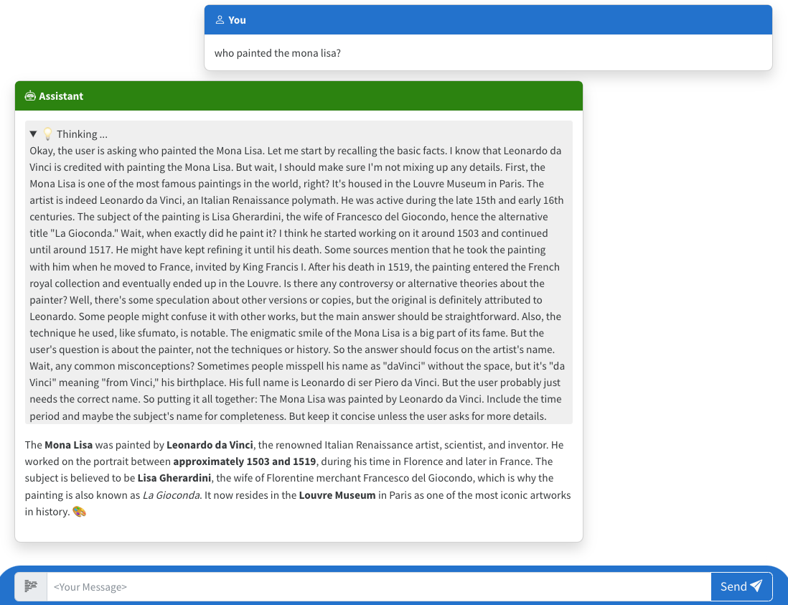

# Simple Chat Application using Azure OpenAI (Python)

[](https://codespaces.new/Azure-Samples/openai-chat-app-entra-auth-builtin)
[](https://vscode.dev/redirect?url=vscode://ms-vscode-remote.remote-containers/cloneInVolume?url=https://github.com/azure-samples/openai-chat-app-entra-auth-builtin)

This repository includes a Python app that uses Azure OpenAI to generate responses to user messages and uses Microsoft Entra for user authentication. The user sign-in functionality uses the [built-in authentication feature of Azure Container Apps](https://learn.microsoft.com/azure/container-apps/authentication), which supports both Microsoft Entra ID and Microsoft Entra External ID.

The project includes all the infrastructure and configuration needed to setup Microsoft Entra authentication, provision Azure OpenAI resources (with keyless access), and deploy the app to [Azure Container Apps](https://learn.microsoft.com/azure/container-apps/overview) using the [Azure Developer CLI](https://learn.microsoft.com/azure/developer/azure-developer-cli/overview).

We recommend first going through the [deployment steps](#deployment) before running this app locally,
since the local app needs credentials for Azure OpenAI to work properly.

## Features

* A Python [Quart](https://quart.palletsprojects.com/en/latest/) backend that uses the [openai](https://pypi.org/project/openai/) package to generate responses to user messages.
* A basic HTML/JS frontend that streams responses from the backend using [JSON Lines](http://jsonlines.org/) over a [ReadableStream](https://developer.mozilla.org/en-US/docs/Web/API/ReadableStream).
* [Bicep files](https://docs.microsoft.com/azure/azure-resource-manager/bicep/) for provisioning Azure resources, including an Azure OpenAI resource, Azure Container Apps (with authentication configuration), and Azure Container Registry.
* Python scripts that use the [msgraph-sdk](https://pypi.org/project/msgraph-sdk/) package to create a Microsoft Entra application and service principal, and to grant the service principal permissions to the application.



## Opening the project

This project has [Dev Container support](https://code.visualstudio.com/docs/devcontainers/containers), so it will be be setup automatically if you open it in Github Codespaces or in local VS Code with the [Dev Containers extension](https://marketplace.visualstudio.com/items?itemName=ms-vscode-remote.remote-containers).

If you're not using one of those options for opening the project, then you'll need to:

1. Create a [Python virtual environment](https://docs.python.org/3/tutorial/venv.html#creating-virtual-environments) and activate it.

2. Install the requirements:

    ```shell
    python -m pip install -r requirements-dev.txt
    ```

3. Install the app as an editable package:

    ```shell
    python -m pip install -e src
    ```

## Deployment

Once you've opened the project in [Codespaces](#github-codespaces), in [Dev Containers](#vs-code-dev-containers), or [locally](#local-environment), you can deploy it to Azure.

### Azure account setup

1. Sign up for a [free Azure account](https://azure.microsoft.com/free/) and create an Azure Subscription.
2. Request access to Azure OpenAI Service by completing the form at [https://aka.ms/oai/access](https://aka.ms/oai/access) and awaiting approval.
3. Check that you have the necessary permissions:

    * Your Azure account must have `Microsoft.Authorization/roleAssignments/write` permissions, such as [Role Based Access Control Administrator](https://learn.microsoft.com/azure/role-based-access-control/built-in-roles#role-based-access-control-administrator-preview), [User Access Administrator](https://learn.microsoft.com/azure/role-based-access-control/built-in-roles#user-access-administrator), or [Owner](https://learn.microsoft.com/azure/role-based-access-control/built-in-roles#owner). If you don't have subscription-level permissions, you must be granted [RBAC](https://learn.microsoft.com/azure/role-based-access-control/built-in-roles#role-based-access-control-administrator-preview) for an existing resource group and [deploy to that existing group](docs/deploy_existing.md#resource-group).
    * Your Azure account also needs `Microsoft.Resources/deployments/write` permissions on the subscription level.

### Microsoft Entra ID setup

We have integrated the sample with Entra ID to require authentication.  This feature allows users within your organization to log in and how to process their identity within the sample. If a user is logged in, they'll see their name in the chat app.

To configure, follow these steps:

1. Create a new azd environment:

    ```shell
    azd env new
    ```

    This will create a folder under `.azure/` in your project to store the configuration for this deployment. You may have multiple azd environments if desired.

1. Set the `AZURE_AUTH_TENANT_ID` azd environment variable to the tenant ID you want to use for Entra authentication:

    ```shell
    azd env set AZURE_AUTH_TENANT_ID your-tenant-id
    ```

1. Login to the azd CLI with the Entra tenant ID:

    ```shell
    azd auth login --tenant-id AUTH-TENANT-ID
    ```

1. Then proceed with the [deployment steps](#deployment) below.

### Microsoft Entra External ID setup

If you want to allow external users to sign up and sign in to the application using their email address or social identity such as Google, Apple or Facebook, you can use [Microsoft Entra External ID](https://developer.microsoft.com/identity/customers). If you don't have an External ID tenant already, you can create a [trial tenant](https://aka.ms/ciam-free-trial) using your Microsoft or Work account.

To deploy, you will need the tenant ID of your External ID. In the instructions below, replace `<YOUR_TENANT_ID>` with the tenant ID you obtain from the Entra Portal.

To configure, follow these steps:

1. Create a new azd environment:

    ```shell
    azd env new
    ```

    This will create a folder under `.azure/` in your project to store the configuration for this deployment. You may have multiple azd environments if desired.

1. Set the `AZURE_AUTH_TENANT_ID` azd environment variable to whichever tenant ID you want to use for Entra authentication:

    ```shell
    azd env set AZURE_AUTH_TENANT_ID your-tenant-id
    ```

1. Set `AZURE_AUTH_LOGIN_ENDPOINT` to the login endpoint for the External ID tenant. That will typically look like "TenantNameHere.ciamlogin.com".

    ```shell
    azd env set AZURE_AUTH_LOGIN_ENDPOINT your-login-endpoint
    ```

1. Login to the azd CLI with the External ID tenant ID:

    ```shell
    azd auth login --tenant-id AUTH-TENANT-ID
    ```

1. Run the script that will setup permissions needed for the rest of the deployment process. Both PowerShell and Bash scripts are provided:

    ```shell
    ./scripts/setup_for_external_id.ps1
    ```

    ```shell
    ./scripts/setup_for_external_id.sh
    ```

1. Now proceed with the [deployment steps](#deployment) below.

### Deployment

Once you have either setup [Microsoft Entra ID](#microsoft-entra-id-setup) or [Microsoft Entra External ID](#microsoft-entra-external-id-setup), you can proceed to deploy the app.

1. If the Azure resources will be created in a different tenant than the Entra tenant, you must now login to Azure with that account:

    ```shell
    azd auth login --tenant-id AZURE-TENANT-ID
    ```

1. Provision and deploy all the resources:

    ```shell
    azd up
    ```

    It will prompt you to provide an `azd` environment name (like "chat-app") and select a subscription from your Azure account. Then it will provision the resources in your account and deploy the latest code. If you get an error or timeout with deployment, changing the location can help, as there may be availability constraints for the OpenAI resource.

1. When `azd` has finished deploying, you'll see an endpoint URI in the command output. Visit that URI, and you should see the chat app! 🎉
1. When you've made any changes to the app code, you can just run:

    ```shell
    azd deploy
    ```

### Deployment with existing resources

If you already have an OpenAI resource and would like to re-use it, first follow these steps.

1. Run `azd env new` to create a new environment. Provide a name that will be used in the name of *new* resources that are created.
2. Run `azd env set` to specify the values for the existing OpenAI resource.

   ```shell
   azd env set AZURE_OPENAI_RESOURCE {name of OpenAI resource}
   azd env set AZURE_OPENAI_RESOURCE_GROUP {name of resource group that it's inside}
   azd env set AZURE_OPENAI_RESOURCE_GROUP_LOCATION {location for that group}
   azd env set AZURE_OPENAI_SKU_NAME {name of the SKU, defaults to "S0"}
   ```

3. Then follow the steps for deployment above.

### CI/CD pipeline

This project includes a Github workflow for deploying the resources to Azure
on every push to main. That workflow requires several Azure-related authentication secrets
to be stored as Github action secrets. To set that up, run:

```shell
azd pipeline config
```

## Development server

Assuming you've run the steps in [Opening the project](#opening-the-project) and have run `azd up`, you can now run the Quart app in your development environment:

```shell
python -m quart --app src.quartapp run --port 50505 --reload
```

This will start the app on port 50505, and you can access it at `http://localhost:50505`.

To save costs during development, you may point the app at a [local LLM server](docs/local_ollama.md).

## Costs

Pricing varies per region and usage, so it isn't possible to predict exact costs for your usage.
The majority of the Azure resources used in this infrastructure are on usage-based pricing tiers.
However, Azure Container Registry has a fixed cost per registry per day.

You can try the [Azure pricing calculator](https://azure.com/e/2176802ea14941e4959eae8ad335aeb5) for the resources:

* Azure OpenAI Service: S0 tier, ChatGPT model. Pricing is based on token count. [Pricing](https://azure.microsoft.com/pricing/details/cognitive-services/openai-service/)
* Azure Container App: Consumption tier with 0.5 CPU, 1GiB memory/storage. Pricing is based on resource allocation, and each month allows for a certain amount of free usage. [Pricing](https://azure.microsoft.com/pricing/details/container-apps/)
* Azure Container Registry: Basic tier. [Pricing](https://azure.microsoft.com/pricing/details/container-registry/)
* Log analytics: Pay-as-you-go tier. Costs based on data ingested. [Pricing](https://azure.microsoft.com/pricing/details/monitor/)

⚠️ To avoid unnecessary costs, remember to take down your app if it's no longer in use,
either by deleting the resource group in the Portal or running `azd down`.

## Security Guidelines

By default, this template uses [Managed Identity](https://learn.microsoft.com/entra/identity/managed-identities-azure-resources/overview) for authenticating to the Azure OpenAI service. It uses an [Azure Key Vault](https://learn.microsoft.com/azure/key-vault/general/basic-concepts) to store the client secret for the Microsoft Entra application.

Additionally, we have added a [GitHub Action](https://github.com/microsoft/security-devops-action) that scans the infrastructure-as-code files and generates a report containing any detected issues. To ensure continued best practices in your own repository, we recommend that anyone creating solutions based on our templates ensure that the [Github secret scanning](https://docs.github.com/code-security/secret-scanning/about-secret-scanning) setting is enabled.

You may want to consider additional security measures, such as:

* Protecting the Azure Container Apps instance with a [firewall](https://learn.microsoft.com/azure/container-apps/waf-app-gateway) and/or [Virtual Network](https://learn.microsoft.com/azure/container-apps/networking?tabs=workload-profiles-env%2Cazure-cli).
* Using [certificates](https://learn.microsoft.com/entra/identity/authentication/how-to-certificate-based-authentication) instead of client secrets for the Microsoft Entra application.

## Resources

* [OpenAI Chat Application with Microsoft Entra Authentication (Python)](https://github.com/Azure-Samples/openai-chat-app-entra-auth-local): Similar to this project, but sets up authentication using the MSAL SDK instead of the built-in authentication feature of Azure Container Apps. This is necessary if you want to deploy an app to a different environment or use authentication during development.
* [OpenAI Chat App with Managed Identity](https://github.com/Azure-Samples/openai-chat-app-quickstart): Similar to this project, but doesn't include Microsoft Entra authentication.
* [RAG chat with Azure AI Search + Python](https://github.com/Azure-Samples/azure-search-openai-demo/): A more advanced chat app that uses Azure AI Search to ground responses in domain knowledge.
* [Develop Python apps that use Azure AI services](https://learn.microsoft.com/azure/developer/python/azure-ai-for-python-developers)
